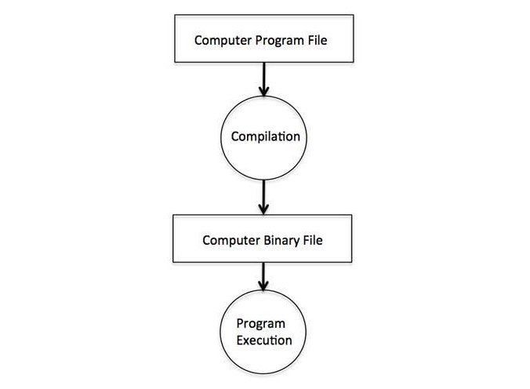
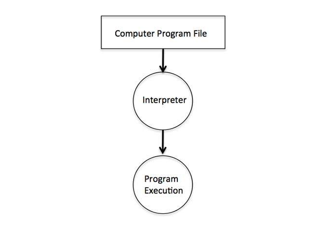

# Compilador

*É um programa (ou conjuntos de programas) que traduz um código fonte para uma linguagem de mais baixo nível 
(a linguagem alvo, que tem uma forma binária conhecida como código objeto), normalmente, o código fonte é escrito em uma
 linguagem de programação de alto nível, com grande capacidade de abstração, e o código objeto é escrito em uma  linguagem de baixo nível, como uma sequência de instruções a ser executadas pelo processador.  
O compilador é um dos dois tipos mais gerais de tradutores, juntamente com o interpretador. 
Algumas linguagens de programação para serem executadas, existe a necessidade de serem primeiro compiladas, logo após  executadas. Exemplo de linguagens que necessitam deste processo é C, C++, Java, Pascal, etc.*

### O diagram abaixo, mostra o fluxo no processo de compilação de um programa 

*Existem também linguagens que são interpretadas, como PHP, JavaScript Python, Ruby, Perl, etc.*

# Interpretador 

*São programas que leem um código fonte de uma linguagem de programação interpretada e o converte em código  executável. Seu funcionamento pode variar de acordo com a implementação. Em alguns casos, o interpretador lê o código  fonte linha a linha e o converte em código objeto (ou bytecode) à medida que o executa, em outros casos, converte o  código fonte por inteiro e depois executa. 
Em princípio, pode-se implementar compiladores e interpretadores para qualquer linguagem de programação. Mas, 
dependendo da necessidade, pode ser melhor criar um interpretador ou um compilador.*

  

### Fonte de referência:
https://www.tutorialspoint.com/computer_programming/index.htm
https://pt.wikiversity.org/wiki/Introdu%C3%A7%C3%A3o_%C3%A0_Teoria_dos_Compiladores/Defini%C3%A7%C3%B5es
https://pt.wikipedia.org/wiki/Interpretador
