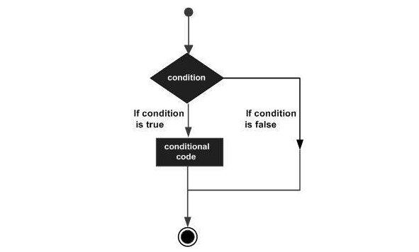
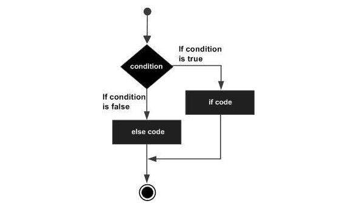
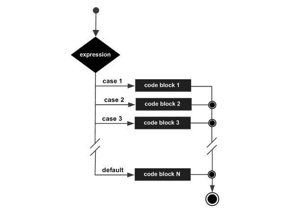

# Estruturas de Decisão

*Declaração de decisões em programação de computadores, haverão várias situações que você terá duas ou mais opções,<br>
e você tem que selecionar uma opção baseado em dada condição.<br>*

*O exemplo abaixo, é sobre um estudante e suas notas:*

*<strong>SE</strong> as notas recebidas forem maior que 95, o estudante é brilhante.<br>
<strong>SE</strong> as notas recebidas forem menor que 30, o estudante é fraco.<br>
<strong>SE</strong> as notas recebidas forem menor que 95 e maior que 30, o estudante é médio.*<br>

*Agora, a questão é escrever o código de programação para esta situação. Observe o diagrama abaixo:*




*Agora, a mesma situação escrito com a linguagem de programação C*
```
include <stdio.h>

int main() {
   int x = 45;
   
   if( x > 95) {
	
      printf( "O estudante é brilhante\n");
   }
   if( x < 30) {
	
      printf( "O estudante é fraco\n");
   }
   if( x < 95 && x > 30 ) {
	
      printf( "O estudante é médio\n");
   }
} 
```
```
Resultado:

O estudante é médio
```

*O programa usa a condicional ```if```, aqui o primeiro ```if```verifica se a condição x é maior que 95 ou não,<br> 
se a condição for verdadeira, executa a estrução printf().<br>
Similar, trabalha o segundo ```if```. Finalmente o terceiro IF é executado.*

*Abaixo temos duas condições:*

```Primeira condição é x > 95```<br>
```Segunda condição é x < 30```<br>


*Os computadores evoluiram, como resultado outras condicionais foram adicionadas,<br>
uma delas, temos a ajuda do operador binário ```&&```.<br>
Se o resultado final é verdadeiro, a declaração da condicional é executada.*


### if ... else

*Uma declaração ```if``` segue uma declaração opcional ```else```, que será executado se a expressão booleana for falso.*<br>

*Abaixo, segue a sintaxe de if, else na linguagem C*
```
if (expressão_booleana) {
	Esta declaração será executada se a expressão booleana é verdadeira

} else {
	Esta declaração será executada se a expressão booleana for falsa
}
```
*Abaixo, segue esta mesma sintaxe representada em forma de diagrama:*




*O mesmo exemplo, agora segue escrito na linguagem C*
```
include <stdio.h>

int main() {
   int x = 45;
   
   if( x > 95) {
	
      printf( "O estudante é brilhante\n");

   } else {

      printf( "O estudante não é brilhante\n");

   }
}
```
```
Resultado:

O estudante não é brilhante
```

### if ... else if ... else

*Uma declaração ```if```, segue como opcional a declaração ```else if... else```, para utilização com várias condicionais.*<br>

*Abaixo segue a sintaxe na linguagem C*

```
if (expressao_booleana 1) {
	Executada se a expressão booleana 1 é verdadeira

} else if (expressao_booleana 2) {
	Executada se a expressão booleana 2 é verdadeira

} else if (expressao_booleana 3) {
	Executada se a expressão booleana 3 é verdadeira

} else {
	Executada se nenhuma das condicionais forem verdadeira
}
```
```
include <stdio.h>

int main() {
   int x = 45;
   
   if( x > 95) {
      printf( "O estudante é brilhante\n");
   } 
   else if( x < 30) {
      printf( "O estudante é fraco\n");
   } 
   else if( x < 95 && x > 30 ) {
      printf( "O estudante é médio\n");
   }
}
```
```
Resultado:

O estudante é médio
```


### switch

*Um ```switch``` é uma declaração alternativa a delcaração ```if```.*

*Segue sintaxe:*

```
switch (variavel) {
	case 1 :
		declaração ...
		break;
	case 2 :
		declaração ...
		break;
	case 3 :
		declaração ...
		break;
	default :
		declaração ...
}
```

*A expressão/variável utilizada em uma declaração switch é um valor inteiro, comparando diferentes casos.*<br> 
*Quando um valor de uma expressão/variável é identificada, a declaração no corpo do bloco é executada e finalizada.*<br> 
*O switch finaliza um bloco com a declaração ```break```.*<br> 
*Se não houver identificação em nenhum dos casos, o default é executado.*

*Abaixo segue a sintaxe representada por diagrama:*




*Agora, segue o mesmo exemplo escrito em C*

```
include <stdio.h>

int main() {
   int x = 2;
   
   switch( x ){
      case 1 :
         printf( "Um\n");
         break;
      case 2 :
         printf( "Dois\n");
         break;
      case 3 :
         printf( "Três\n");
         break;
      case 4 :
         printf( "Quatro\n");
         break;
      default :
         printf( "Nenhuma da opções acima...\n");
   }
}  
```
```
Resultado:

Dois
```
<br><br>

### Fonte de referência:
https://www.tutorialspoint.com/computer_programming/index.htm

