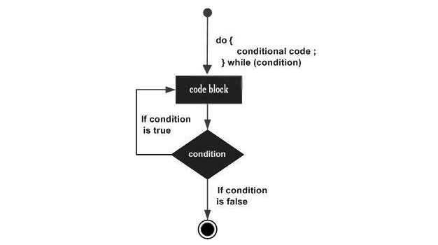

# Loops

*Considere a situação abaixo, aqui um simples programa em C.*
```
include <stdio.h>

int main() {
   printf( "Hello, World!\n");
   printf( "Hello, World!\n");
   printf( "Hello, World!\n");
   printf( "Hello, World!\n");
   printf( "Hello, World!\n");
}
```
```
Resultado:

Hello, World!
Hello, World!
Hello, World!
Hello, World!
Hello, World!
```

*Isso é simples, agora, considere a situação de escrever Hello, World!, umas mil vezes.<br>
Todas as linguagens de programação possui um conceito de loop.<br>
Vamos escrever um programa em C com ajuda do loop while e depois falaremos mais sobre isso.*
```
include <stdio.h>

int main() {
   int i = 0;
   
   while ( i < 5 ) {
      printf("Hello, World!\n");
      i = i + 1;  // poderia ser i++;
   }
}
```
```
Resultado:

Hello, World!
Hello, World!
Hello, World!
Hello, World!
Hello, World!
```
*Note, que o resultado é exatamente igual ao primeiro exemplo mostrado logo acima,<br> 
porém agora de forma automatizada.<br>
Basicamente, o loop ```while``` verifica a condição ```(i < 5)```, sendo verdadeiro, o programa irá printar na<br>
tela o resultado ```Hello, World!```, a cada interação ```i = i + 1``` o programa verifica se o valor de ```i``` <br>
ainda é menor que 5. Não sendo mais, ou seja, sendo falso, o programa encerra a execução.*


### while

*O loop while está disponivel na linguagem de programação em C, segue abaixo a sintaxe:*

```
while (condicao) {
	bloco de codigo ...
}
```

*O mesmo código pode ser representado o fluxo por forma de diagrama:*


### do... while

*Um loop ```while``` verifica primeiro a condição antes de executar a declaração no bloco de código.<br> 
No caso ```do while```, primeiro executa a declaração no bloco de código, depois verifica a condição.*<br>

*Segue sintaxe do while:*

```
do {
	bloco de codigo ...
}
while (condicao);
```

*O mesmo código pode ser representado o fluxo por forma de diagrama:*




*Se você escrever o exemplo Hello, World usando ```do while```, terá o mesmo resultado.*

```
include <stdio.h>

int main() {
   int i = 0;
   
   do {
      printf("Hello, World!\n");
      i = i + 1;  // poderia ser i++
   }
   while ( i < 5 );
}
```
```
Resultado:

Hello, World!
Hello, World!
Hello, World!
Hello, World!
Hello, World!
```

#### break

*A declaração break encerra imediatamente o loop.<br>
Segue em forma de diagrama e código para um melhor entendimento:*


```
include <stdio.h>

int main() {
   int i = 0;
   do {
      printf("Hello, World!\n");
      i = i + 1;
      
      if( i == 3 ) {
         break;
      }
   }
   while ( i < 5 );
}
```
```
Resultado:

Hello, World!
Hello, World!
Hello, World!
```

*Note que assim que a condição ```if``` é verdadeira o programa para, printando na tela somente três vezes o resultado Hello, World!*<br>

### break

*A declaração continue na linguagem de programação em C trabalha de forma similar ao break.<br>
No entanto o break força o encerramento do programa, já o continue força a continuação do mesmo.*<br>

*Segue em forma de diagrama e código para um melhor entendimento:*


```
include <stdio.h>

int main() {
   int i = 0;
   do {
      if( i == 3 ) {
         i = i + 1;
         continue;
      }
      printf("Hello, World!\n");
      i = i + 1;
   }
   while ( i < 5 );
}
```
```
Resultado:

Hello, World!
Hello, World!
Hello, World!
Hello, World!
```

*Note que ao contrario do do break, quando o programa encontra o ```if```, existe a declaração ```continue```,<br>
que neste caso informa que a interação deve continuar, seguindo o fluxo e produzindo um resultado final diferente do break.*  

<br><br>

### Fonte de referência:
https://www.tutorialspoint.com/computer_programming/index.htm