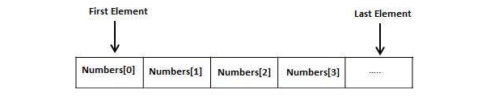
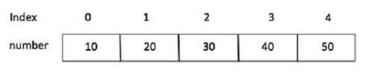

# Arrays

*Considerando a situação abaixo, você precisa armazenar 5 números inteiros.<br>
Se você usar um programa simples usando variáveis e conceitos de tipos de dados.*

```
include <stdio.h>

int main() {

	// declarando as variáveis 
   int number1;
   int number2;
   int number3;
   int number4;
   int number5;
   
   // inicializando as variáveis
   number1 = 10;      
   number2 = 20;   
   number3 = 30;   
   number4 = 40; 
   number5 = 50;     

   // printando o resultado na tela para o usuário
   printf( "number1: %d\n", number1);
   printf( "number2: %d\n", number2);
   printf( "number3: %d\n", number3);
   printf( "number4: %d\n", number4);
   printf( "number5: %d\n", number5);
}
```

*Isto é simples, porque você armazena 5 números inteiros. Agora se tivermos que armazenar 5000 números<br> 
inteiros, faremos o uso de 5000 variáveis?<br>
Nesta situação, todas as linguagens de programação provem o conceito de chamada de array.<br> 
Um array é uma estrutura de dados que armazena um espaço fixo de coleção de elementos do mesmo tipo de dados.<br>
Iniciando a declaração de variáveis individuais, number1, number2 ... number99, você poder declarar uma<br> 
variável array ```number``` do tipo inteiro e usar number1[0], number1[1], e... number1[99]<br>
que representam as variáveis individuais.<br>
Aqui, 0, 1, 2, ...99 são indices associado a variável, que são usados representando os elementos individuais<br> disponivel no array. Todo array consiste na continua locação de memória.*




### Criando Arrays 

*Para criar uma variável array em C, o programador especifica o tipo de elemento e o número de elementos que serão<br> armazenados no array. Sintaxe criando um array em C:*

```tipo nome_do_array [tamanho_do_array];```


*Essa chamada é de um array de única dimensão. Por exemplo, agora declaro um array de 10 elementos<br>
chamado ```number``` do tipo de dado inteiro, use a declaração:*

```int number[10];```

*Aqui, number é uma variável array, suficiente para guardar 10 números inteiros.* 


#### Inicializando Arrays

*Você pode inicializar um array em C, um por um, ou usando uma única declaração, segue:*

```int number[5] = {10, 20, 30, 40, 50};```

*O números de valores entre ```{ }``` não pode ser maior que o número de elementos declarado no array entre ```[ ]```.<br>
 Se você omitir o tamanho do array, o array se ajusta a inicialição criada, portanto você escreve*

```int number[] = {10, 20, 30, 40, 50};```


*Segue um exemplo para atribuição de um único elemento do array:*

```number[4] = 50;```

*A declaração acima, atribuiu o valor 50 ao elemento da quinta posição do array. Todos os arrays tem o indice 0 ao<br> primeiro elemento, isso é chamado de base do indice, e o último indice é o tamanho total do array<br>
Segue imagem de uma representação de array para melhor entendimento:*




### Acessando elementos do Array

*Um elemento do array é acessado por indexação do nome do array, por exemplo.*

```int var = number[9];```

*A declaração acima tem 10 posições para o array que atribui a variável ```var```.<br>
Segue exemplo escrito em C, para um melhor entendimento:*

```
include <stdio.h>
 
int main () {

   int number[10]; 
   int i = 0;
         
   while( i < 10 ) {	
      number[ i ] = i + 100;
      i = i + 1;
   }
   
   i = 0;
   while( i < 10 ) {
      printf("number[%d] = %d\n", i, number[i] );
      i = i + 1;
   }
   
   return 0;
}
```
*No exemplo acima utilizei o loop (laço) ```while``` para percorrer o array inserindo valores.<br> 
Esta mesma forma pode ser utilizada com o laço ```for```, e sinceramente deixa o código até mais limpo.*

```
include <stdio.h>

int main() {
	
	int number[10];
	
	for (int i = 0; i < 10; i++) {
		number[i] = i + 100;
	}

	for (int i = 0; i < 10; i++) {
		 printf("number[%d] = %d\n", i, number[i] );

	}

	return 0;
}
```
```
Resultado:

number[0] = 100
number[1] = 101
number[2] = 102
number[3] = 103
number[4] = 104
number[5] = 105
number[6] = 106
number[7] = 107
number[8] = 108
number[9] = 109
```


<br><br>

### Fonte de referência:
https://www.tutorialspoint.com/computer_programming/index.htm

